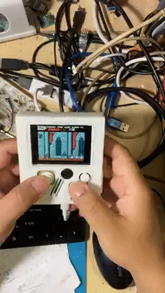

# rp2040-ili9341-iinfones

This is a handheld game console based on RP2040, designed for playing MakeCode Arcade games. Inspired by https://github.com/shuichitakano/pico-infones and https://github.com/fhoedemakers/pico-infonesPlus with thanks to "infones" https://github.com/jay-kumogata/InfoNES, I have made it capable of playing NES games as well. The main difference between this project and others is that I use the ILI9341 LCD, which is overclocked with the RP2040, along with an overclocked SPI interface, allowing this handheld to barely play NES games. If the screen display is reduced to showing only one out of every three frames, then the game speed can reach an acceptable level. Currently, I am still working on the sound aspect of the project.
