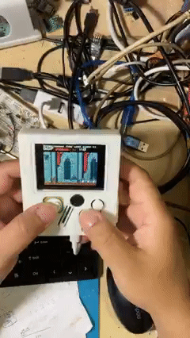

# rp2040-ili9341-infones

**Build and usage instructions: [`software/infones/README.md`](software/infones/README.md)** — toolchain setup, pin assignments, how to get games onto the SD card, and what an FDS disk image additionally needs.

This is a handheld game console based on RP2040, designed for playing MakeCode Arcade games. Inspired by https://github.com/shuichitakano/pico-infones and https://github.com/fhoedemakers/pico-infonesPlus with thanks to "infones" https://github.com/jay-kumogata/InfoNES, I have made it capable of playing NES games as well. The main difference between this project and others is that I use the ILI9341 LCD, which is overclocked with the RP2040, along with an overclocked SPI interface, allowing this handheld to barely play NES games.

Famicom Disk System (mapper 20) images are supported as well: two-sided disks, side switching and saving all work. The FDS BIOS is Nintendo code and is not part of this repository — see the build README for where to put it. The FDS expansion sound channel is not emulated yet, so FDS music is missing its lead voice.
